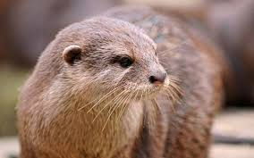

<!DOCTYPE html>
<html>

<head>
  <meta charset="utf-8">
  <title>ottegram</title>
  <link rel="stylesheet" href="stylesheets/styles.css">
</head>

<body>
  <header>
    <h1 class = "logo-text">Ottegram</h1>
    <ul class="header-nav-bar">
      <li class="nav-bar-item">
        <a href="./about.html">О выдрах</a>
      </li>
      <li class="nav-bar-item">
        <a href="./index.html">Фото</a>
      </li>
      <li class="nav-bar-item">
        <a href="./mail.html">Написать нам</a>
      </li>
    </ul>
  </header>

  <main>
    
    <h1 class="p">Всем привет! </h1>
    

      Меня зовут Barry, а моих друзей Robin, Maurice, Lesley и Jo. И как вы могли заметить мы выдры!
      Мы давно наблюдаем, что на нас в интернете обращают мало внимания, уделяя его всё больше котикам и решили это исправить!
      И сейчас я расскажу вам о таком загадочном зверьке, как выдра!
    

    <h1 class="thumbnail-title">Кто такие выдры?</h1>
    

      Вообще выдрой называют хищное млекопитающее, ведущее полуводный образ жизни и принадлежащее к семейству куньих.
      Подсемейство насчитывает 5 родов и 17 видов, среди которых наиболее известны
      выдра обыкновенная либо речная (это я, Jo, Lesley, Maurice), калан, морская выдра (к ним относться Robin), бразильская и кавказская выдра.
      Все виды выдр занесены в международную Красную книгу: наш ценный мех, к сожалению вот уже на протяжении не одного столетия привлекает к себе внимание браконьеров.
      Описание выдр разных родов отличается в зависимости от вида. Так, длина тела колеблется от 55 до 95 см, при этом оно очень гибкое, мускулистое и длинное.
      Длина хвоста составляет от 22 до 55 см, он толстый у основания, сужающийся к концу, непушистый.
      Самой крупной считается бразильская или гигантская выдра, которая живёт на берегах Амазонки и Ориноко.
    

    <h1 class="thumbnail-title">Выдра + вода</h1>
    

      По сравнению с массой выдры имеют большие лёгкие, что позволяет нам пребывать под водой около четырёх минут.
      Чтобы получить порцию воздуха, нам вовсе не обязательно полностью всплывать:
      достаточно высунуть на поверхность кончик носа – это даёт возможность полностью наполнить лёгкие кислородом и вернуться под воду.
      Морду мы имеем широкую, уши маленькие. На морде и коленях находятся вибриссы, благодаря которым выдра улавливает наименьшее движение в воде,
      при этом мы получаем почти всё информацию о добыче: её размеры, скорость и куда именно движется.
      Когда выдра находится под водой, его ноздри и ушные отверстия перекрываются клапанами, блокируя путь воде.
      Лапы короткие, пять пальцев соединены плавательными перепонками, благодаря которым мы быстро передвигается в воде,
      а в погоне за добычей можем проплыть под водой около трёхсот метров. Задние лапы несколько длиннее передних – это даёт нам возможность великолепно плавать.
    

    <h1 class="thumbnail-title">Мех</h1>
    

      Свой мех выдры без внимания не оставляют и подолгу ухаживают за ним, расчёсывают и разглаживают:
      если мы не будем этого делать, шерсть будет грязной, перестанет сохранять тепло, и выдра умрёт от переохлаждения (жирового запаса у нас нет).
      Со стороны это выглядит так, как будто мы играемся, очищая мех от различных загрязнений.
      Чтобы заполнить подшерсток воздухом, выдры часто кувыркаются и переворачиваются в воде.
    

    <h1 class="thumbnail-title">Место обитания</h1>
    

      На одном месте мы живём не всегда, особенно Lesley, постоянно находя новые водоёмы.
      Летом мы предпочитаем держаться одного участка, удаляясь от него не более чем на несколько километров.
      А вот зимой всё зависит от того, насколько промерзает вода: на полностью покрытых льдом водоёмах мы не живём.
       Если участок полностью замёрз, выдры покидают его и в поисках подходящего водоёма способны преодолеть не один десяток километров и даже перейти через горы.
       Выше всех поднимается кавказская выдра – она великолепно себя чувствует на высоте, превышающей две с половиной тысячи метров.
       Выдры нор не роют и селятся в покинутой бобровой норе, в природных пещерах или углублениях под корнями прибрежных деревьев.
       Место для поселения мы выбираем тщательно, очень важно, чтобы оно было незаметно и труднодоступно, а добраться до жилища можно лишь по одной-единственной тропе,
       очень редко прокладываем дополнительные ходы.
       Кроме основной норы у нас на участке в запасе есть ещё несколько убежищ, находятся они довольно далеко от воды,
       на расстоянии около ста метров – и в них можно пересидеть период, когда река выходит из берегов и затапливает окрестности.
    

    <h1 class="thumbnail-title">Образ жизни</h1>
    

      Хотя многие считают нас ночными животными, мы вполне можем вести активный образ жизни вечером и даже днём, если считаем, что нам не угрожает опасность.
      В основном выдры любят жить поодиночке, но встречаются виды, которые одиночества не любят.
      Например, гигантская выдра от европейских сородичей отличается тем, что активна днём, не очень боязлива, живёт в группах и охотится в стаях: животные с разных сторон
      сгоняют рыбу в одно место.
      Несмотря на то, что мы почти всё своё время проводят в воде, многие из нас неплохо себя чувствуют и на суше, по которой передвигаются рысью,
      оставляя извилистый след, и нередко совершаем полутораметровые прыжки в длину.
      А вот по рыхлому снегу из-за коротких конечностей двигаемся с трудом, галопом, сильно сгорбившись при этом. Если же снег более-менее уплотнён,
      выдры чередуют прыжки со скольжением на брюхе.

    

    <h1 class="thumbnail-title">Характер</h1>
    

      А ещё мы очень энергичны и игривы. Недалеко от наших нор можно обнаружить «катальные горки» – возвышенности с укатанным следом,
      который остался от скользившего на брюхе зверька.
      На эту горку выдра поднимается по нескольку раз за день и с разбегу съезжает вниз.
      Ещё одной любимой забавой является ловля собственного хвоста или задней лапы, нередко играем и с пойманной рыбой, после чего съедая её.
      Летом, когда в водоёме много корма, выдры живут на одном месте и далеко от участка не удаляются.
      Питается выдра рыбой (если пойдёте на рыбалку не забудьте оставить нам пару штучек), лягушками, крабами, а также ловит грызунов и даже птиц.
      Наши охотничьи угодья в это время года составляют от 2 до 18 километров по реке и 100 метров от берега вглубь суши.
      Зимой, если рыба уходит или замерзает лёд, затрудняя тем самым охоту, в поисках пропитания мы вполне способны за день преодолеть от 15 до 20 километров.

    

    <h1 class="thumbnail-title">Морские выдры</h1>
    

  Образ жизни морской выдры несколько отличается от обитающих возле пресных водоёмов.
  Обитают представители этого вида в основном на тихоокеанском побережье Южной Америки и почти все её подвиды (исключение – калан) отличаются небольшими размерами:
   её вес колеблется от 3 до 6 килограмм.
   Интересно, что пресных водоёмов морская выдра избегает и селится лишь на морском побережье.
   Зверь обустраивает жилище на каменистом побережье, где дуют сильные ветра, а участок берега постоянно затопляется водой во время приливов
   (нора находится на границе самого высокого уровня прилива).
   Вдоль берега обычно растут плотные кустарники или невысокие деревья – это даёт ей возможность обустроить в логове два выхода: один в море, другой – на сушу.
   Для большинства видов характерен одиночный образ жизни, поэтому жилища свои они обустраивают на расстоянии не менее двухсот метров друг от друга.
   Правда, агрессии к забредшим на их территорию чужакам не проявляют.
      По своей природе морская выдра очень боязлива, а потому увидеть её непросто, даже несмотря на то, что в отличие от речной родственницы,
      ведёт дневной образ жизни, пребывая в воде большую часть своего времени (не покидая воды, они, перевернувшись на спину и положив добычу на брюхо, даже питаются).
      Охотясь, морская выдра без проблем способна погрузиться на глубину около пятидесяти метров (причём делает это очень быстро – за 15-30 секунд).
      Вглубь суши животное удаляется в основном, когда преследует добычу, при этом удалиться от берега может на полкилометра.
      Морская выдра очень хорошо лазает по расположенным вдоль берега скалам, а также ей очень нравится отдыхать в густых зарослях.
    

    <h1 class="thumbnail-title">Спасибо, что прочитали это!</h1>
    

      Итак, на этом всё! Возможно в другой раз мы бы рассказали вам и больше, но похоже Lesley нашла косяк моей любимой рыбы... Надеюсь после этого рассказа вы будете
      лайкать в интернете не только котиков и енотов! Так же можете <a href="./index.html">нажать Сюда и посмотреть пару наших фоток</a> или
      <a href = "./mail.html">нажать Сюда и написать нам E-Mail</a>.
    

  </main>
</body>

</html>
